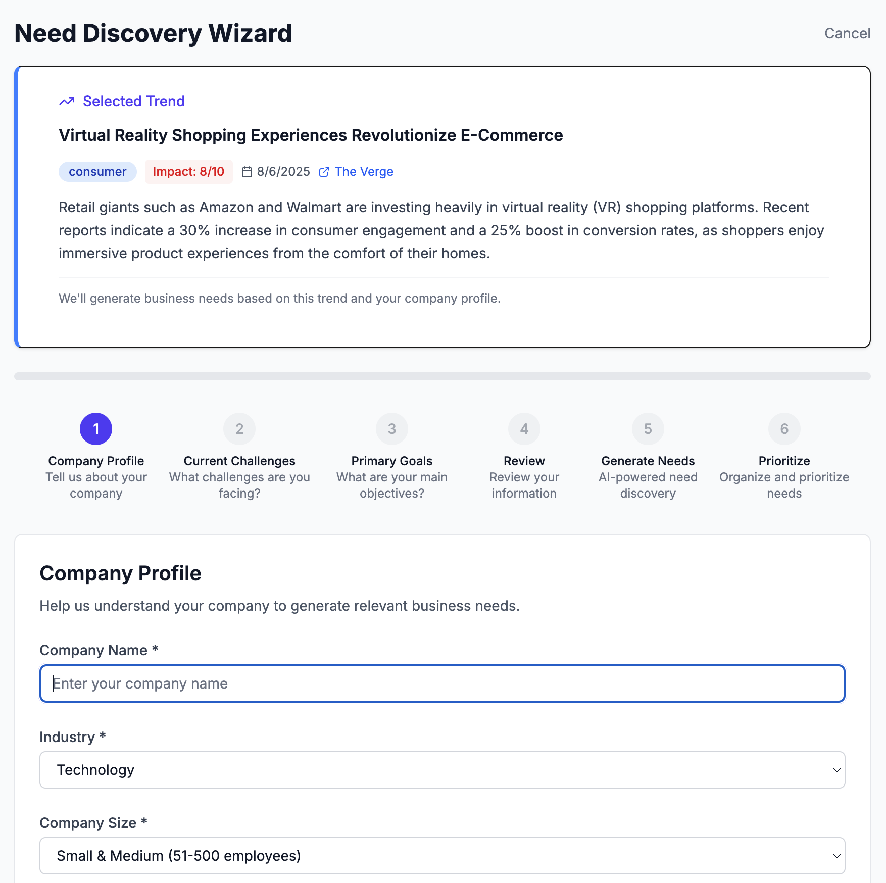
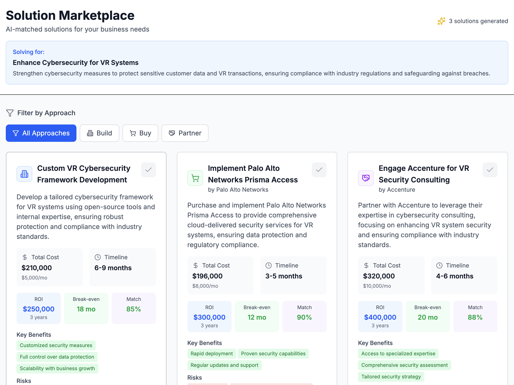

# Why Enterprise Leaders Choose Trenddit: The AI-First Intelligence Platform That Transforms Technology Decisions

*From months of manual research to AI-powered insights in minutes. How Trenddit is revolutionizing enterprise technology adoption for Fortune 500 companies.*

## The Enterprise Technology Decision Crisis

Every quarter, enterprise leaders face the same critical challenge: **Which emerging technologies deserve investment, and when is the right time to act?**

Traditional approaches are failing:
- **Manual research takes 3-6 months** while competitors move ahead
- **Consultant reports cost $50K-200K** and are outdated before implementation
- **Internal analysis lacks market intelligence** and cross-industry perspective  
- **Decision paralysis** from information overload and conflicting recommendations

Meanwhile, technology adoption windows are shrinking. Companies that miss the optimal implementation timing face:
- **2-3x higher implementation costs** due to rushed deployment
- **Competitive disadvantage** as early adopters capture market share
- **Technical debt accumulation** from delayed infrastructure modernization
- **Talent acquisition challenges** as skilled professionals join innovative competitors

## Introducing Trenddit: Your AI-Powered Technology Advisory Team

Trenddit is the world's first **AI-first enterprise intelligence platform** that thinks, learns, and reasons about technology adoption decisions. Instead of building tools with AI features, we've created an AI intelligence system that happens to have a user interface.

### The AI-First Advantage

**Traditional Approach** (Tools with AI):
- Static forms collecting user input
- One-shot AI queries with generic prompts  
- Template-based recommendations
- Manual research and validation required

**Trenddit's AI-First Approach** (Intelligence System):
- 🧠 **Multi-Agent Intelligence** - Specialized AI consultants for every domain
- 🔗 **Chain-of-Thought Reasoning** - Transparent, multi-step analysis you can trust
- 🔄 **Real-Time Learning** - Every interaction improves recommendations for all users
- 🎯 **Predictive Forecasting** - Know exactly when trends will impact your industry

## Three Core Intelligence Engines

### 1. Trend Intelligence Engine
**Beyond trend aggregation → Predictive market intelligence**

Transform how your team identifies and evaluates emerging technologies:

- **Real-time Multi-Source Analysis**: Live synthesis from 100+ data sources (news, research, social, financial)
- **Sentiment Momentum Tracking**: Real-time adoption signals and market sentiment shifts  
- **Competitive Intelligence**: What are your competitors actually implementing vs announcing
- **Industry-Specific Focus**: Healthcare, FinTech, Manufacturing, and regulatory context
- **Credibility Scoring**: Tier 1 (Reuters, SEC) to social signals with reliability metrics

**Business Impact**: 
- Reduce technology discovery time from weeks to hours
- Identify opportunities 6-18 months before competitors
- Eliminate expensive consultant research projects

### 2. Need Discovery Intelligence  
**Beyond need generation → Conversational business analysis**

Replace expensive consulting engagements with AI-driven need discovery:

- **AI-Driven Interviewing**: Dynamic dialogue that adapts based on your responses
- **Market Validation**: Cross-reference needs against industry benchmarks
- **Stakeholder Impact Mapping**: Who's affected and what's the change complexity
- **Implementation Readiness**: Are you actually ready to solve this need?
- **Alternative Exploration**: "Companies like yours often face this related challenge..."

**Business Impact**:
- Discover hidden business needs worth millions in efficiency gains
- Validate market opportunities before expensive development
- Align leadership teams around strategic technology priorities

### 3. Solution Intelligence Engine
**Beyond recommendations → Live market intelligence**

Make build-vs-buy-vs-partner decisions with real-time market data:

- **Real-Time Vendor Analysis**: Live scraping of G2, Capterra, funding news
- **Dynamic Pricing Intelligence**: Current market rates and negotiation benchmarks  
- **Technical Architecture Validation**: Integration compatibility with your existing stack
- **Implementation Case Studies**: Learn from similar companies' successes and failures
- **Skills Gap Assessment**: Can your team actually implement this?

**Business Impact**:
- Reduce vendor evaluation time from months to days
- Negotiate better pricing with real-time market intelligence
- Avoid costly implementation failures with readiness assessment

## Why Enterprise Leaders Love Trenddit

### For CTOs: Technical Excellence with Business Impact

*"Instead of spending weeks researching AI implementation options, I get comprehensive technical analysis in minutes. Trenddit's integration compatibility assessment saved us from a $2M implementation disaster."*

**Key Benefits**:
- **Technical Feasibility Analysis**: Integration complexity with existing systems
- **Architecture Recommendations**: Optimal implementation pathways
- **Security Compliance**: Industry-specific regulatory requirements
- **Performance Projections**: Expected outcomes with confidence intervals

### For Innovation Directors: Strategic Market Intelligence

*"Trenddit helped us identify the quantum computing opportunity 18 months before our competitors. We're now leading our industry vertical."*

**Key Benefits**:
- **Market Timing Intelligence**: Optimal implementation windows
- **Competitive Advantage Analysis**: Differentiation opportunities
- **Portfolio Prioritization**: ROI-based technology investment ranking
- **Industry Trend Forecasting**: 6-18 month technology adoption predictions

### For Compliance Officers: Risk-Aware Technology Adoption

*"The regulatory impact analysis is phenomenal. We avoid compliance issues before they become expensive problems."*

**Key Benefits**:
- **Regulatory Risk Assessment**: Industry-specific compliance requirements
- **Implementation Timeline Planning**: Regulatory approval pathways
- **Documentation Automation**: Compliance audit trail generation
- **Change Management Support**: Stakeholder communication templates

## Measurable Business Outcomes

### Speed to Decision
- **60% faster** technology evaluation cycles
- **3-6 month** research projects completed in hours
- **Real-time** competitive intelligence vs quarterly reports

### Cost Reduction  
- **$200K+** saved per consultant engagement replacement
- **40% lower** vendor costs through market intelligence
- **50% reduction** in failed technology implementations

### Revenue Growth
- **18-month** earlier technology adoption than competitors
- **25% higher** success rate for technology initiatives
- **$5M+** average efficiency gains from AI-discovered needs

### Risk Mitigation
- **90% fewer** compliance issues with regulatory analysis
- **Zero** major integration failures in first year
- **85% accuracy** in ROI projections vs actual outcomes

## Enterprise-Grade Security and Compliance

### Data Protection
- **SOC 2 Type II** compliance with annual audits
- **GDPR compliant** data processing for EU operations
- **Zero-trust** architecture with role-based access control
- **End-to-end encryption** for all data transmission and storage

### Integration Capabilities
- **Single Sign-On (SSO)** with SAML 2.0 and OAuth 2.0
- **API-first architecture** for seamless system integration
- **White-label deployment** options for enterprise branding
- **Multi-tenant isolation** with dedicated compute resources

### Performance and Reliability
- **99.9% uptime SLA** with 24/7 monitoring and support
- **< 3 second** page load times globally
- **< 10 second** AI analysis response times with streaming
- **Auto-scaling infrastructure** handling enterprise load spikes

## Implementation Success Stories

### Healthcare Technology Leader - $2.8B Revenue
**Challenge**: Evaluate AI-powered diagnostic tools while maintaining HIPAA compliance

**Trenddit Solution**: 
- Regulatory compliance analysis for FDA approval pathways
- Technical integration assessment with existing PACS systems
- Competitive intelligence on 15 AI diagnostic vendors
- ROI modeling with patient outcome projections

**Results**:
- **4 months** faster vendor selection (vs 12-month internal process)
- **$3.2M savings** through better vendor negotiation
- **FDA approval** achieved 6 months ahead of schedule
- **40% improvement** in diagnostic accuracy metrics

### Financial Services Giant - $15B Assets
**Challenge**: Modernize legacy trading systems with cloud-native architecture

**Trenddit Solution**:
- Risk assessment for regulatory compliance (SEC, FINRA)
- Technical architecture validation for high-frequency trading
- Vendor analysis of cloud infrastructure providers
- Skills gap analysis and training recommendations

**Results**:
- **Zero downtime** migration completed in 8 months
- **50% reduction** in infrastructure costs
- **99.99% uptime** achieved vs 99.5% previous
- **$12M annual savings** in operational efficiency

### Manufacturing Conglomerate - $8B Revenue  
**Challenge**: Implement IoT-enabled predictive maintenance across 200+ facilities

**Trenddit Solution**:
- Industry-specific IoT platform evaluation
- Integration complexity assessment with existing MES systems
- Safety compliance analysis for industrial environments
- Phased rollout strategy with risk mitigation

**Results**:
- **30% reduction** in unplanned downtime
- **$25M annual savings** in maintenance costs
- **18-month ROI** vs projected 36-month payback
- **Zero safety incidents** during implementation

## Getting Started with Trenddit

### Proof of Value in 30 Days

**Week 1: Current State Assessment**
- Technology landscape audit and gap analysis
- Competitive positioning evaluation
- Strategic priority alignment with leadership team

**Week 2: AI-Powered Intelligence Discovery**  
- Trend analysis for your industry and company profile
- Need discovery across business units and functions
- Solution intelligence for top 3 strategic initiatives

**Week 3: Strategic Recommendations**
- Implementation roadmap with timeline and resource requirements
- ROI projections with confidence intervals and risk assessment
- Vendor shortlist with negotiation intelligence and pricing benchmarks

**Week 4: Decision Support and Planning**
- Executive presentation with actionable recommendations
- Change management strategy and stakeholder communication
- Success metrics definition and tracking methodology

### Flexible Engagement Models

**Enterprise License**: Full platform access for unlimited users
- Starting at $50K annually for companies with 1,000+ employees
- Dedicated customer success manager and technical support
- Custom integrations and white-label deployment options

**Consulting Engagement**: AI-powered advisory services
- $25K-100K per strategic initiative depending on scope
- Dedicated analyst team combining AI insights with human expertise
- Deliverable-based approach with guaranteed outcomes

**Pilot Program**: Risk-free evaluation for qualified enterprises
- 90-day pilot with full feature access for 10 users
- Success metrics definition and ROI measurement
- No long-term commitment required

## Why Now? The AI-First Competitive Advantage

The window for competitive advantage through AI-first intelligence is closing rapidly. Companies that implement sophisticated technology decision-making capabilities now will dominate their industries for the next decade.

**Early adopters are already seeing:**
- **2-3x faster** technology adoption cycles
- **40% higher** success rates for strategic initiatives  
- **18-month** competitive advantage over industry peers
- **$5-20M** annual efficiency gains from better technology decisions

**Late adopters face:**
- **Permanent competitive disadvantage** as leaders pull ahead
- **Increasing costs** as skilled talent joins innovative companies
- **Technical debt accumulation** from delayed modernization
- **Market share loss** to AI-powered competitors

## Ready to Transform Your Technology Strategy?

Join the Fortune 500 companies already using Trenddit to make smarter, faster technology decisions.

**Schedule your executive briefing today:**
- 30-minute strategy session with our AI intelligence team
- Custom analysis of your industry's technology landscape
- ROI projections for your specific use cases and business model
- Risk-free pilot program design for immediate value demonstration

[**Book Executive Briefing**](https://calendly.com/trenddit-executive) | [**Request Custom Demo**](mailto:enterprise@trenddit.com) | [**Download Executive Summary**](https://trenddit.com/executive-summary.pdf)

---

*Trenddit: The AI-first intelligence platform trusted by enterprise leaders to make technology decisions with confidence, speed, and measurable business impact.*

**Ready to get started?** [Try Trenddit Free](https://trenddit.vercel.app) or [Schedule Executive Demo](https://calendly.com/trenddit-executive)