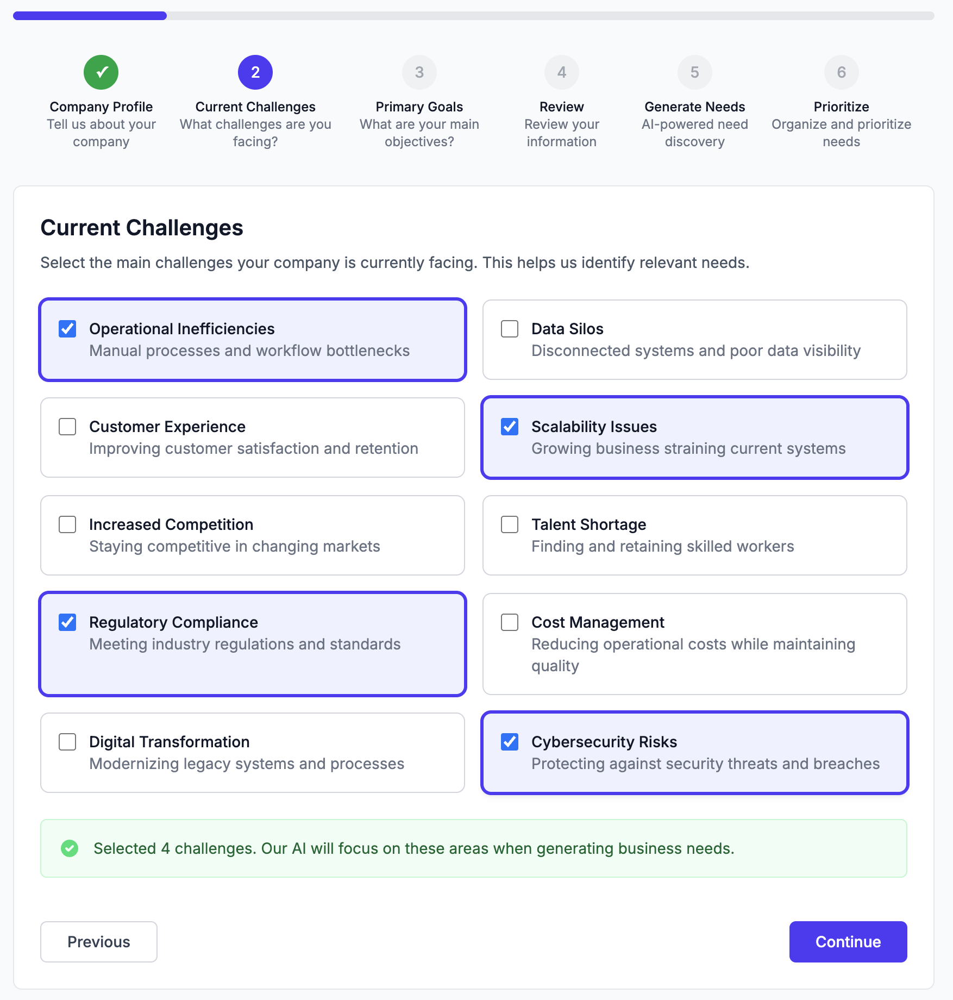
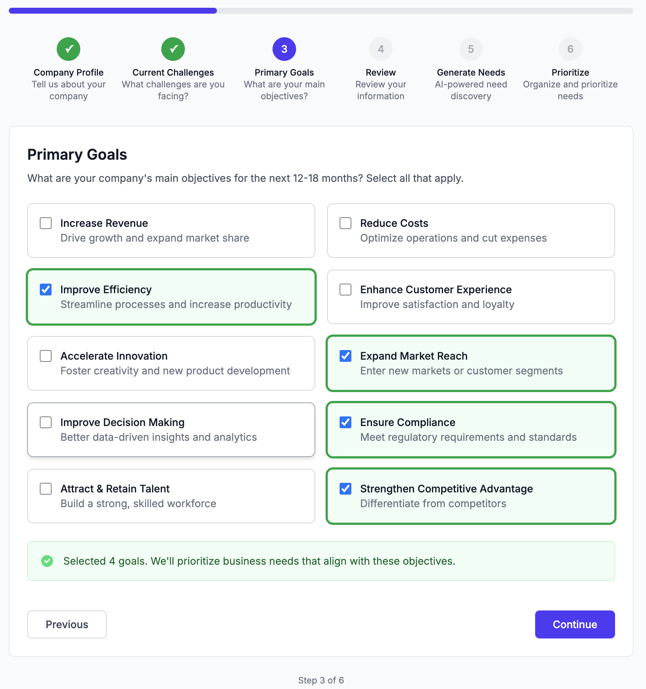
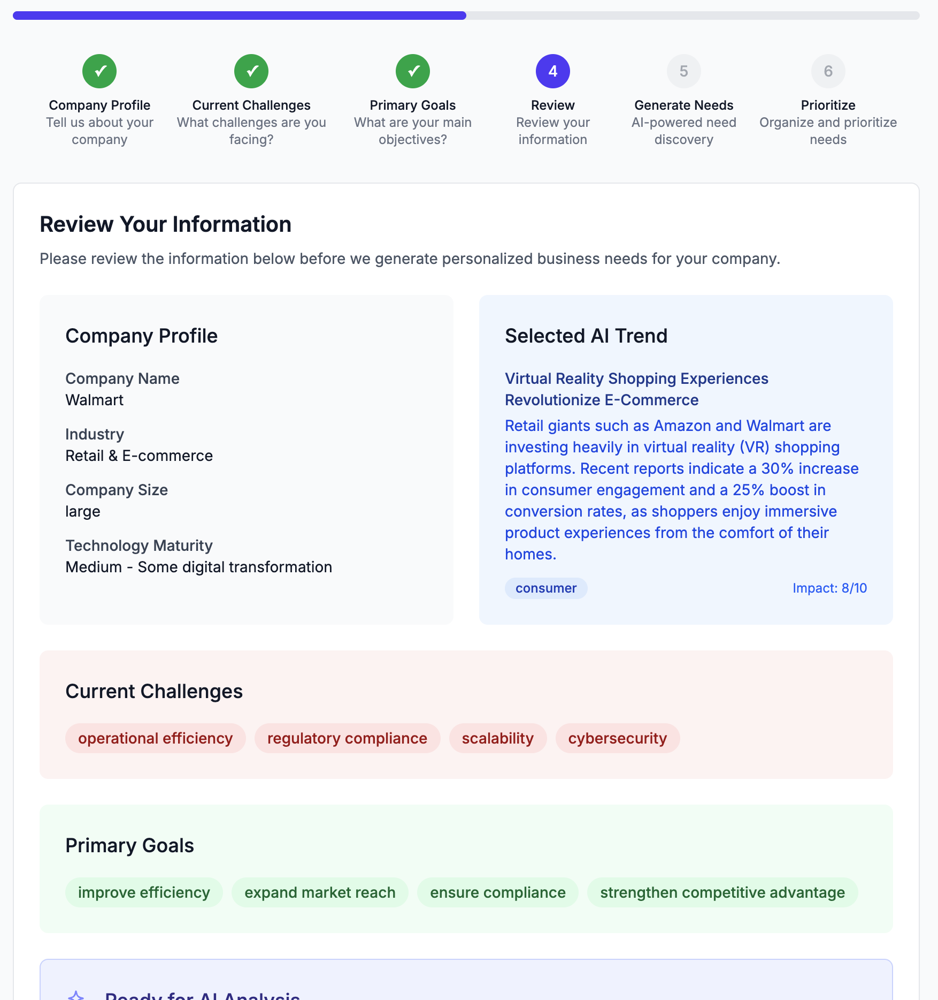
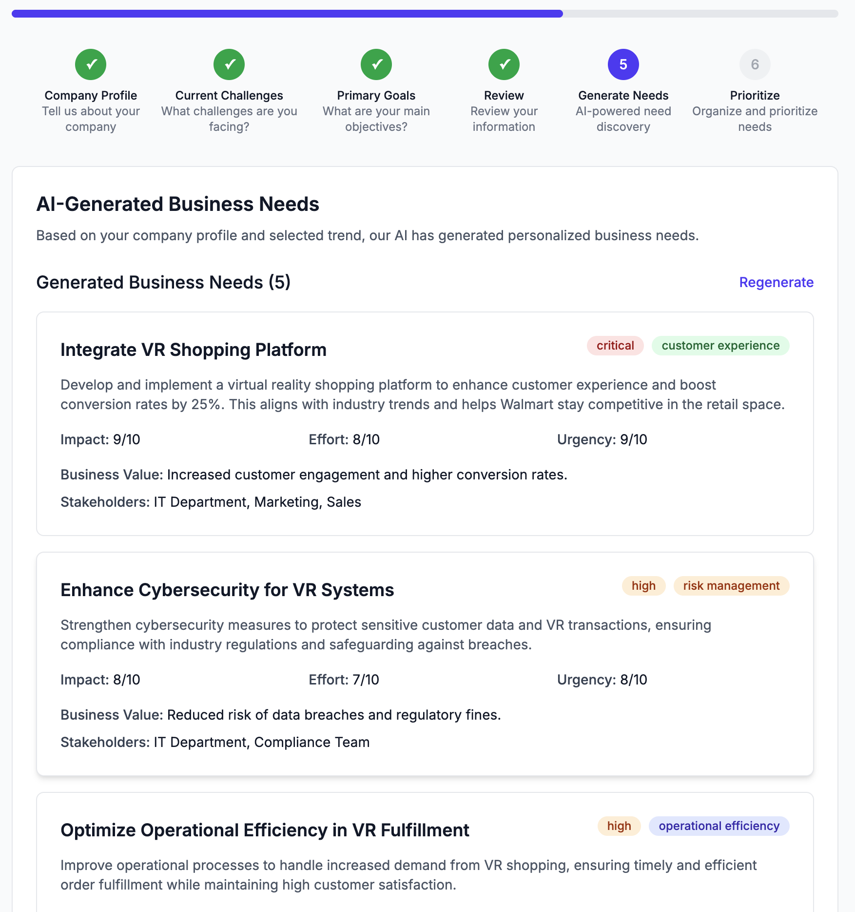
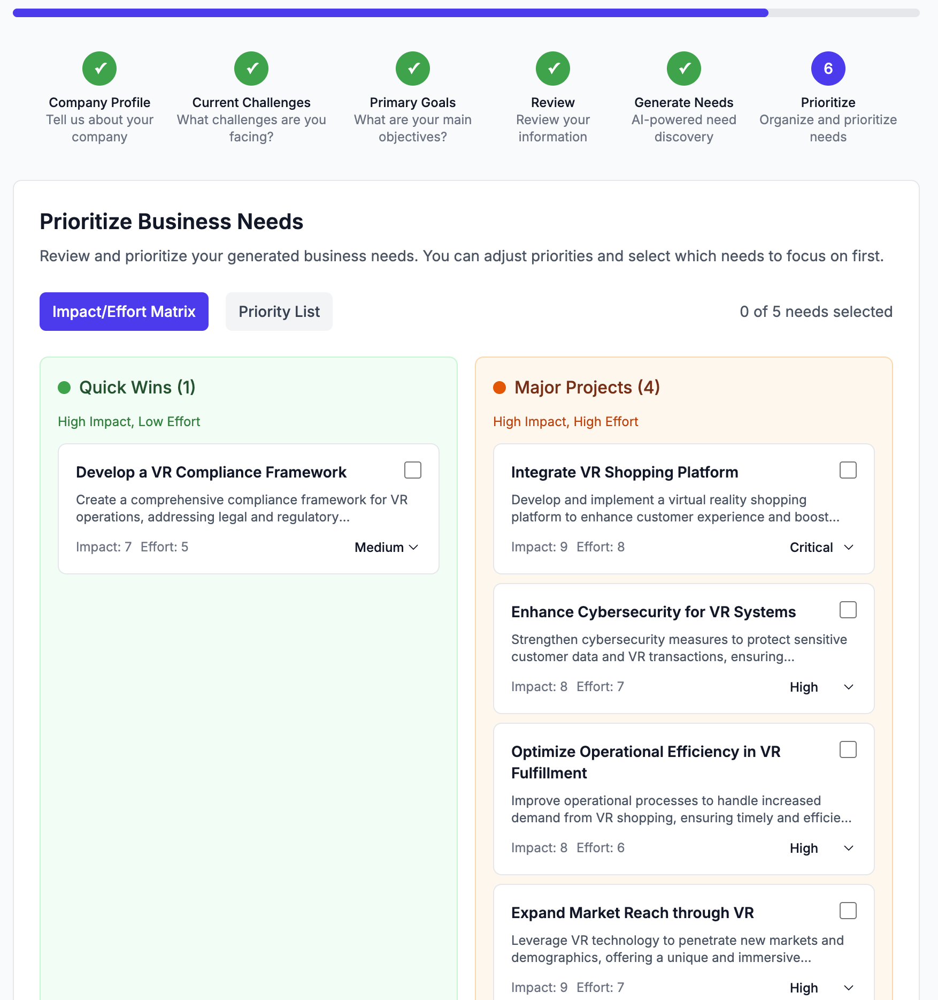

# Getting Started with Trenddit: Your Complete Guide to AI-Powered Enterprise Intelligence

*A step-by-step guide to unlocking the full potential of Trenddit's AI-first intelligence platform for smarter technology decisions*

## Welcome to the Future of Enterprise Intelligence

Trenddit transforms how enterprise teams discover, evaluate, and implement emerging technologies. This comprehensive guide will take you from first login to generating actionable intelligence for your organization's most critical technology decisions.

**What you'll learn:**
- Platform setup and company profile optimization
- Trend discovery and analysis workflows
- Need generation and validation processes  
- Solution evaluation and ROI analysis
- Advanced features and best practices

## Prerequisites and Setup

### System Requirements

**Browser Compatibility**: Chrome 90+, Firefox 88+, Safari 14+, Edge 90+
**Internet Connection**: High-speed recommended for real-time AI analysis
**Account Type**: Business email required for enterprise features

### Getting Your API Keys

For full AI functionality, you'll need an OpenAI API key:

1. **Visit OpenAI Platform**: Go to [platform.openai.com](https://platform.openai.com)
2. **Create Account**: Sign up with your business email
3. **Generate API Key**: Navigate to API keys section and create new key
4. **Configure Billing**: Add payment method for API usage (typically $20-50/month for enterprise use)

### Initial Platform Setup

1. **Access Trenddit**: Visit [trenddit.vercel.app](https://trenddit.vercel.app)
2. **Create Account**: Sign up with your corporate email address
3. **Add API Key**: 
   - Go to Settings → API Configuration
   - Paste your OpenAI API key
   - Test connection to verify setup

**Without API Key**: You'll see clear setup instructions and example workflows, but no live AI analysis.

## Step 1: Configure Your Company Profile

Your company profile is crucial for personalized intelligence. The AI uses this information to:
- Filter relevant trends for your industry and size
- Assess technical feasibility based on your likely infrastructure
- Provide compliance guidance for your regulatory environment
- Benchmark against similar companies

### Essential Profile Fields

**Industry Selection**:
- Technology: Software, hardware, telecommunications
- Healthcare: Hospitals, pharmaceuticals, medical devices
- Finance: Banking, insurance, fintech, trading
- Manufacturing: Industrial, automotive, aerospace, consumer goods

**Company Size**:
- Startup (1-50 employees)
- Small & Medium (51-500 employees)  
- Enterprise (501-5000 employees)
- Large Enterprise (5000+ employees)

**Market Focus**:
- Business-to-Business (B2B)
- Business-to-Consumer (B2C)  
- Business-to-Government (B2G)
- Platform/Marketplace

**Geographic Market**:
- United States
- European Union
- Asia-Pacific
- Global

### Pro Tips for Profile Optimization

✅ **Be Specific**: "Healthcare Technology for Hospitals" vs generic "Healthcare"
✅ **Update Regularly**: Quarterly profile reviews ensure relevant recommendations
✅ **Include Compliance Needs**: HIPAA, GDPR, SOX, etc. for regulatory analysis
✅ **Specify Tech Stack**: Current systems help with integration analysis

## Step 2: Discover and Analyze Trends

The Trend Intelligence Engine is your window into emerging technologies that matter for your business.

### Navigation and Interface

**View Modes**:
- **Cards View**: Visual overview with quick insights (recommended for browsing)
- **Rows View**: Detailed expandable layout (recommended for deep analysis)

**Category Filters**:
- **Consumer**: B2C technologies and user experience trends
- **Competition**: Competitive landscape and market positioning  
- **Economy**: Market dynamics and financial implications
- **Regulation**: Compliance and regulatory changes

### Using the AI Analysis Features

**Generate Trends Button**: Creates personalized trends based on your company profile
- Processing time: 30-60 seconds
- Sources: 100+ real-time data feeds
- Output: 10-20 highly relevant trends with confidence scores

**Individual Trend Analysis**:
1. Click on any trend card for detailed view
2. Review AI confidence score (aim for 70%+ for strategic decisions)
3. Examine source credibility (prefer Tier 1 and Tier 2 sources)
4. Read chain-of-thought reasoning for transparency

### Understanding Trend Intelligence

**Impact Scores** (1-10 scale):
- **8-10**: Critical for your industry, investigate immediately
- **6-7**: Significant opportunity, plan for 6-12 month evaluation
- **4-5**: Worth monitoring, assess annually
- **1-3**: Low priority for your specific profile

**Source Attribution**:
- **Blue links**: Tier 1 sources (government, academic, major financial)
- **Green links**: Tier 2 sources (industry analysts, major publications)  
- **Orange links**: Tier 3 sources (social media, job boards, community discussions)

## Step 3: Generate and Validate Business Needs

Transform trends into actionable business needs through AI-powered discovery.

### The 6-Step Need Discovery Process

**Step 1: Company Profile**
- Automatically populated from your account settings
- Add specific context for the selected trend
- Include current challenges and strategic goals

**Step 2: Current Challenges**  
- Describe existing pain points in your organization
- AI will connect these to trend implications
- Be specific: "Manual data entry takes 20 hours/week" vs "Inefficient processes"

**Step 3: Primary Goals**
- Define your 12-18 month strategic objectives
- AI aligns trend opportunities with business goals
- Include measurable outcomes when possible

**Step 4: Review Information**
- Validate AI understanding of your context
- Edit any misinterpretations before need generation
- Add additional context if needed

**Step 5: AI-Powered Need Generation**  
- AI generates 3-5 specific business needs
- Each need includes stakeholder impact analysis
- Implementation complexity estimation included

**Step 6: Prioritization**
- Rank needs by business impact and urgency
- Consider resource constraints and dependencies
- Export prioritized needs for solution evaluation

### Need Quality Assessment

**High-Quality Needs Include**:
- Specific, measurable outcomes
- Clear stakeholder identification  
- Implementation complexity assessment
- Business value quantification

**Red Flags to Address**:
- Vague descriptions without metrics
- Missing stakeholder analysis
- Unrealistic timelines
- Unclear success criteria

## Step 4: Evaluate Solutions and Calculate ROI

Transform validated needs into implementation-ready solutions with real-time market intelligence.

### Solution Approach Framework

**Build Approach**:
- Custom development with internal team
- Full control over features and timeline
- Higher upfront cost, ongoing maintenance responsibility
- Best for: Unique requirements, existing development capabilities

**Buy Approach**:  
- Commercial off-the-shelf (COTS) software
- Faster implementation, vendor support included
- Monthly/annual licensing costs, customization limitations
- Best for: Standard requirements, proven solutions needed

**Partner Approach**:
- Joint development or revenue-sharing model  
- Shared costs and risks, strategic alignment
- Complex negotiations, shared IP considerations
- Best for: Innovation projects, market expansion

### ROI Analysis and Financial Modeling

**Key Metrics Provided**:
- **Total Cost of Ownership (TCO)**: 3-year projection including all costs
- **Return on Investment (ROI)**: Percentage return with confidence intervals
- **Break-even Timeline**: Months to recover initial investment
- **Match Score**: AI assessment of solution fit (aim for 85%+ for final selection)

**Cost Components**:
- Software licensing or development costs
- Implementation and integration expenses
- Training and change management
- Ongoing maintenance and support
- Hidden costs and risk factors

### Vendor Intelligence Features

**Real-time Market Data**:
- Current pricing from G2, Capterra, and vendor websites
- Recent funding announcements and company stability
- Customer reviews and satisfaction scores
- Technical compatibility assessments

**Competitive Analysis**:
- Side-by-side feature comparison
- Market positioning and differentiation
- Customer base and case studies
- Integration ecosystem and partnerships

## Advanced Features and Best Practices

### Collaborative Workflows

**Team Sharing**:
- Export trend analyses as PDF reports
- Share need discovery results across departments
- Collaborate on solution evaluations with stakeholders

**Executive Presentations**:
- Auto-generated executive summaries
- Business case templates with ROI projections
- Implementation roadmaps and resource requirements

### Integration and Automation

**API Access** (Enterprise plans):
- Integrate trend data into existing dashboards
- Automate need generation for quarterly planning
- Connect solution intelligence to procurement systems

**Webhook Notifications**:
- Real-time alerts for high-impact trends in your industry
- Need generation completion notifications
- Solution updates and pricing changes

### Maximizing AI Analysis Quality

**Best Practices for Trend Analysis**:
1. **Regular Profile Updates**: Monthly profile reviews improve relevance
2. **Source Diversity**: Prefer trends with 3+ different source types
3. **Confidence Thresholds**: Use 70%+ confidence for strategic decisions
4. **Cross-Validation**: Verify critical insights with internal experts

**Optimizing Need Discovery**:
1. **Specific Context**: Detailed company information improves need quality
2. **Quantified Challenges**: Include metrics and timelines where possible  
3. **Stakeholder Input**: Involve department heads in need validation
4. **Iterative Refinement**: Use conversation feature for need clarification

**Solution Evaluation Excellence**:
1. **Multiple Approaches**: Always evaluate build vs buy vs partner
2. **Total Cost Focus**: Consider 3-year TCO, not just initial costs
3. **Risk Assessment**: Factor implementation complexity into decisions
4. **Pilot Programs**: Start with limited scope for proof of value

## Troubleshooting Common Issues

### API and Configuration Issues

**Problem**: "OpenAI API key not working"
**Solution**: 
- Verify key is active at platform.openai.com
- Check billing account has available credits
- Ensure key has proper permissions for GPT-4 access

**Problem**: "Trends not loading"
**Solution**:
- Refresh browser and clear cache
- Check internet connection stability  
- Verify company profile is complete

### Analysis Quality Issues

**Problem**: "Trends seem generic or irrelevant"
**Solution**:
- Update company profile with more specific industry details
- Add current technology stack information
- Include specific business challenges and goals

**Problem**: "Low confidence scores on analysis"
**Solution**:  
- Normal for emerging technologies with limited data
- Cross-reference with industry experts
- Focus on trends with multiple high-quality sources

### Performance Optimization

**Problem**: "Slow AI analysis responses"
**Solution**:
- Expected response time: 1-3 seconds for analysis
- Use high-speed internet connection
- Clear browser cache if performance degrades

**Problem**: "Incomplete trend analysis"
**Solution**:
- Wait for full analysis completion (up to 60 seconds)
- Refresh page if analysis stalls
- Contact support for persistent issues

## Support and Resources

### Getting Help

**Documentation**: [docs.trenddit.com](https://docs.trenddit.com)
**Community Forum**: [community.trenddit.com](https://community.trenddit.com)
**Email Support**: [support@trenddit.com](mailto:support@trenddit.com)
**Enterprise Support**: [enterprise@trenddit.com](mailto:enterprise@trenddit.com)

### Training and Certification

**Webinar Series**: Monthly "Trenddit Mastery" sessions
**Video Tutorials**: Step-by-step guides for each feature
**Best Practices Blog**: Weekly insights and case studies
**Enterprise Training**: Custom workshops for teams of 10+

## Next Steps: Becoming a Power User

### Week 1: Foundation Building
- Complete company profile setup
- Generate your first 10 personalized trends
- Complete one full need discovery workflow
- Evaluate solutions for your highest-priority need

### Week 2: Advanced Analysis
- Experiment with different industry and size combinations
- Use chain-of-thought reasoning for complex decisions
- Compare build vs buy vs partner approaches
- Create your first executive presentation

### Week 3: Team Integration  
- Share analyses with colleagues and gather feedback
- Establish regular trend review meetings (weekly/bi-weekly)
- Create evaluation criteria for future technology decisions
- Document your organization's technology adoption process

### Week 4: Optimization and Scale
- Refine company profile based on usage insights
- Establish confidence score thresholds for different decision types
- Create template workflows for common evaluation scenarios
- Plan quarterly strategic technology review sessions

## Measuring Success: Key Performance Indicators

**Speed Metrics**:
- Technology evaluation time: Target 80% reduction vs manual research
- Decision-to-implementation timeline: Target 60% improvement
- Executive alignment: Target <2 weeks from analysis to approval

**Quality Metrics**:
- Implementation success rate: Target >85% for high-confidence recommendations  
- ROI accuracy: Target ±20% variance from AI projections
- Stakeholder satisfaction: Target >4.0/5.0 for analysis quality

**Business Impact**:
- Competitive advantage: Earlier technology adoption vs industry peers
- Cost optimization: Better vendor negotiations through market intelligence
- Innovation acceleration: Increased number of successful pilot projects

Ready to transform your technology decision-making process? Start with trend discovery and work through each workflow systematically. The AI learns from your usage patterns and improves recommendations over time.

**Get started today**: [Launch Trenddit](https://trenddit.vercel.app) and begin your journey toward AI-powered enterprise intelligence.

---

*For technical support or enterprise training, contact our team at [support@trenddit.com](mailto:support@trenddit.com)*