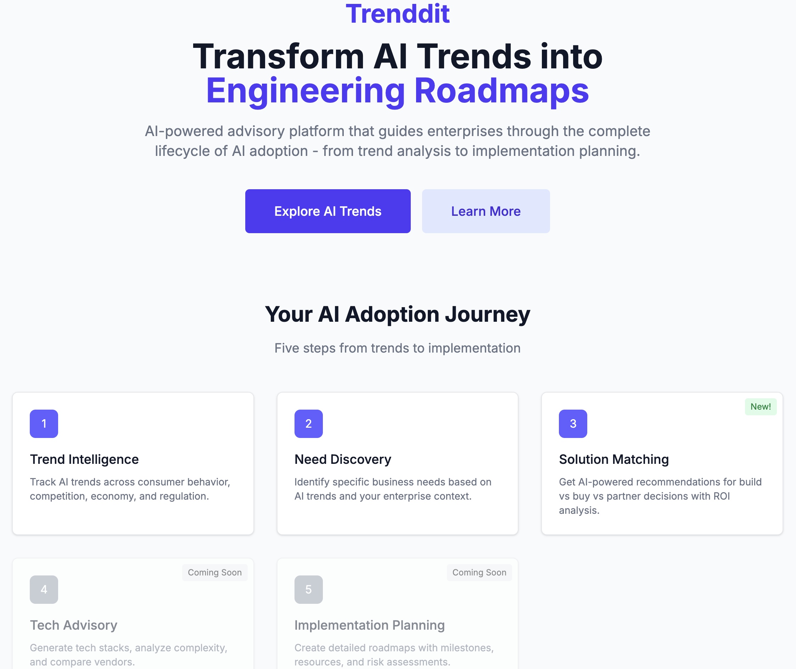

# Trenddit Blog: AI-First Enterprise Intelligence Resources

*Comprehensive guides, research insights, and practical tutorials for leveraging AI-powered trend analysis in enterprise decision-making*

## Welcome to the Trenddit Knowledge Hub

Discover how AI-first intelligence systems are transforming enterprise technology adoption decisions. Whether you're a CTO evaluating emerging technologies, an innovation director planning strategic initiatives, or a business leader seeking competitive advantage, our comprehensive blog provides the insights you need.

---

## 📚 Our Complete Blog Library

### 🔬 Research & Technical Deep Dives

#### [The Science Behind AI-Driven Trend Analysis: A Deep Dive into Multi-Agent Intelligence Systems](ai-driven-trend-analysis-research.md)

*Academic-level exploration of Trenddit's technical architecture and AI methodologies*

**What you'll learn:**
- Multi-agent intelligence system architecture
- Data source integration and credibility scoring methodologies
- Chain-of-thought reasoning for enterprise intelligence
- Real-time intelligence synthesis and processing pipelines
- Predictive modeling and forecasting algorithms
- Performance metrics and validation frameworks

**Perfect for:** CTOs, AI researchers, technical architects, data scientists

**Key topics:** GPT-4o integration, tiered reliability systems, cross-reference validation, industry-specific intelligence templates

---

### 💼 Business Strategy & Market Intelligence

#### [Why Enterprise Leaders Choose Trenddit: The AI-First Intelligence Platform That Transforms Technology Decisions](enterprise-ai-advisory-platform.md)

*Business-focused overview of Trenddit's value proposition and competitive advantages*

**What you'll learn:**
- The enterprise technology decision crisis and traditional approach failures
- AI-first vs tools-with-AI paradigm differences
- Three core intelligence engines and their business impact
- Measurable ROI outcomes and performance metrics
- Enterprise-grade security, compliance, and integration capabilities
- Real-world implementation success stories from Fortune 500 companies

**Perfect for:** Business executives, innovation directors, procurement teams, enterprise decision-makers

**Key topics:** Business case development, competitive advantage analysis, implementation success stories, enterprise sales engagement

---

### 🚀 User Guides & Getting Started

#### [Getting Started with Trenddit: Your Complete Guide to AI-Powered Enterprise Intelligence](getting-started-with-trenddit.md)

*Comprehensive step-by-step tutorial for new users and teams*

**What you'll learn:**
- Platform setup and API configuration
- Company profile optimization for personalized intelligence
- Trend discovery and analysis workflows
- Need generation and validation processes
- Solution evaluation and ROI calculation methods
- Advanced features, troubleshooting, and best practices

**Perfect for:** New users, team administrators, enterprise implementation teams, training coordinators

**Key topics:** Setup guides, workflow tutorials, best practices, troubleshooting, team collaboration features

---

## 🎯 Choose Your Learning Path

### For Technical Leaders (CTOs, Engineering VPs, Technical Directors)

**Recommended Reading Order:**
1. [AI-Driven Trend Analysis Research](ai-driven-trend-analysis-research.md) - Understand the technical foundation
2. [Getting Started Guide](getting-started-with-trenddit.md) - Hands-on platform experience  
3. [Enterprise Platform Overview](enterprise-ai-advisory-platform.md) - Business case development

**Focus Areas:**
- Multi-agent AI architecture and specialized intelligence domains
- Technical feasibility analysis and integration complexity assessment
- Performance metrics, reliability scoring, and prediction accuracy
- Enterprise-grade security, compliance, and scalability features

### For Business Executives (CEOs, Innovation Directors, Strategy Leaders)

**Recommended Reading Order:**
1. [Enterprise Platform Overview](enterprise-ai-advisory-platform.md) - Value proposition and business impact
2. [Getting Started Guide](getting-started-with-trenddit.md) - Practical implementation insights
3. [AI-Driven Trend Analysis Research](ai-driven-trend-analysis-research.md) - Technical confidence building

**Focus Areas:**
- Competitive advantage through AI-first intelligence systems
- ROI calculations, cost reduction opportunities, and revenue growth potential
- Enterprise implementation success stories and measurable outcomes
- Strategic decision-making acceleration and risk mitigation

### For Implementation Teams (IT Managers, Business Analysts, Project Managers)

**Recommended Reading Order:**
1. [Getting Started Guide](getting-started-with-trenddit.md) - Complete implementation roadmap
2. [AI-Driven Trend Analysis Research](ai-driven-trend-analysis-research.md) - Technical understanding for configuration
3. [Enterprise Platform Overview](enterprise-ai-advisory-platform.md) - Stakeholder communication and change management

**Focus Areas:**
- Step-by-step setup and configuration procedures
- Team onboarding, training, and collaboration workflows
- Troubleshooting, optimization, and performance monitoring
- Integration patterns and enterprise deployment considerations

---

## 🏗️ Platform Overview: Your AI Adoption Journey

### Phase 1: Trend Intelligence
**Track AI trends across consumer behavior, competition, economy, and regulation**
- Real-time analysis from 100+ credible data sources
- Company profile-based personalization and relevance scoring
- Multi-source validation with confidence indicators
- Industry-specific regulatory and compliance context

### Phase 2: Need Discovery  
**Identify specific business needs based on AI trends and your enterprise context**
- AI-powered conversational need generation and validation
- Stakeholder impact mapping and change complexity assessment
- Implementation readiness evaluation and resource planning
- Priority ranking with business impact and urgency scoring

### Phase 3: Solution Matching
**Get AI-powered recommendations for build vs buy vs partner decisions with ROI analysis**
- Real-time vendor intelligence and competitive positioning
- Technical integration complexity and compatibility assessment
- Financial modeling with 3-year TCO and ROI projections
- Implementation case studies and success probability modeling

---

## 🔍 Content Categories

### Research & Development
- [AI-Driven Trend Analysis Research](ai-driven-trend-analysis-research.md): Multi-agent intelligence systems, technical architecture, and research methodologies

### Business Strategy  
- [Enterprise AI Advisory Platform](enterprise-ai-advisory-platform.md): Value proposition, competitive advantages, and business outcomes

### Implementation Guides
- [Getting Started with Trenddit](getting-started-with-trenddit.md): Setup, workflows, best practices, and team enablement

### Coming Soon
- **Industry-Specific Guides**: Healthcare AI adoption, FinTech regulation compliance, Manufacturing IoT integration
- **Advanced Analytics**: Custom dashboards, API integrations, enterprise reporting
- **Case Studies**: Detailed implementation stories from enterprise customers
- **Video Tutorials**: Screen recordings of key workflows and advanced features

---

## 🎯 Key Features Highlighted Across Our Content

### Multi-Agent Intelligence System
- **Market Intelligence Agent**: Real-time synthesis from 100+ data sources with credibility scoring
- **Business Analysis Agent**: Organizational needs assessment and change management complexity
- **Solution Architecture Agent**: Technical feasibility and integration analysis
- **Vendor Intelligence Agent**: Live market positioning and competitive analysis
- **Risk Assessment Agent**: Regulatory, technical, and business risk evaluation

### Real-Time Data Processing
- Live market intelligence from news, research, social media, financial, and government sources
- Cross-reference validation requiring minimum 3-source verification
- Tiered reliability scoring (Tier 1: 0.9+, Tier 2: 0.8+, Tier 3: 0.65+)
- Intelligent cache invalidation with domain-specific refresh cycles

### Chain-of-Thought Reasoning
- Transparent multi-step analysis with confidence scoring for each reasoning step
- Alternative perspective generation for balanced decision-making
- Evidence-based recommendations with supporting source attribution
- Success probability modeling based on historical outcomes and market dynamics

---

## 💡 Getting Maximum Value from Our Content

### For First-Time Readers
1. **Start with Overview**: Read the enterprise platform article for context
2. **Hands-On Experience**: Follow the getting started guide step-by-step
3. **Deep Dive**: Explore technical research for complete understanding
4. **Implementation**: Apply insights to your organization's technology decisions

### For Regular Users
- **Monthly Reviews**: Revisit best practices articles quarterly for optimization opportunities
- **Feature Updates**: Check for new capabilities and advanced workflow techniques
- **Team Training**: Use guides for onboarding new team members and stakeholders
- **Success Metrics**: Reference KPI frameworks for measuring platform impact

### For Enterprise Teams
- **Executive Briefings**: Use business-focused content for leadership presentations
- **Technical Validation**: Reference research articles for architecture and security discussions
- **Training Programs**: Implement structured learning paths based on role-specific recommendations
- **Change Management**: Leverage case studies and success stories for organizational buy-in

---

## 🔗 Related Resources

### Platform Access
- **Live Platform**: [trenddit.vercel.app](https://trenddit.vercel.app)
- **API Documentation**: [docs.trenddit.com](https://docs.trenddit.com)
- **Community Forum**: [community.trenddit.com](https://community.trenddit.com)

### Support and Training  
- **Enterprise Support**: [enterprise@trenddit.com](mailto:enterprise@trenddit.com)
- **Technical Support**: [support@trenddit.com](mailto:support@trenddit.com)
- **Training Webinars**: Monthly "Trenddit Mastery" sessions
- **Custom Workshops**: Available for enterprise teams of 10+ users

### Stay Updated
- **Product Updates**: Follow [@trenddit](https://twitter.com/trenddit) for feature announcements
- **Industry Insights**: Subscribe to our monthly intelligence briefing
- **Community Discussions**: Join conversations with other enterprise AI adopters

---

*Ready to transform your technology decision-making process with AI-first intelligence? Start with our [Getting Started Guide](getting-started-with-trenddit.md) or [explore the platform](https://trenddit.vercel.app) directly.*

**Questions?** Contact our team at [hello@trenddit.com](mailto:hello@trenddit.com) for personalized guidance on leveraging AI-powered enterprise intelligence for your organization.